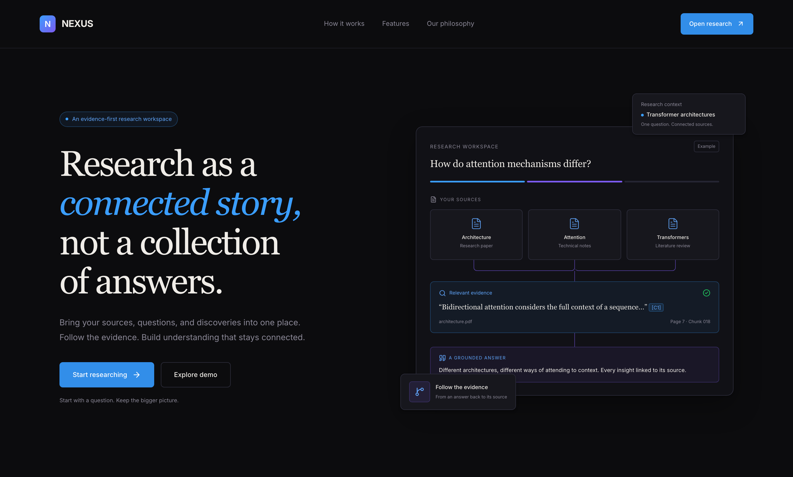
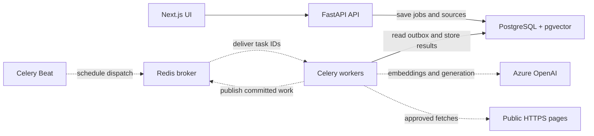

# Nexus — Agentic Research Engine

Nexus is a local research platform that turns selected documents and approved web pages into cited answers and reports.

## Project Overview

Research across several sources is easy to lose track of: questions branch, evidence lives in different files, and conclusions become hard to verify. A single retrieve-and-answer pass can miss those separate aspects. Nexus keeps each investigation in a workspace, breaks complex questions into bounded tasks, and preserves the evidence behind its findings.

## Key Features

- **Inputs:** Text-extractable PDF and DOCX, legacy DOC, and specific public HTTPS pages approved for each run.
- **Research:** Focused answers, source comparison, multi-document synthesis, evidence-only search, and bounded agentic research with parallel retrieval tasks.
- **Retrieval:** Azure embeddings with pgvector search, PostgreSQL keyword search, or their rank-fused hybrid.
- **Traceability:** Saved source snapshots, exact-passage citations, source coverage, reported gaps, and exportable reports.
- **Continuity:** Persistent jobs, task progress, cancellation, retries, and recovery after worker interruption.

## System Architecture

PostgreSQL stores parsed source text, vectors, plans, task state, results, and the delivery outbox; original uploads live in a local artifact volume. Redis carries Celery messages, not document text or cached prompts.

## How It Works

1. **Intake:** Create a workspace, upload documents, and optionally approve exact web URLs. Parsed content is chunked, embedded, and saved as source snapshots.
2. **Plan:** Agentic mode proposes one to three focused retrieval questions; other modes use fixed plans. The server validates task types, dependencies, source scope, and budgets.
3. **Execute:** Celery runs independent retrieval branches in parallel. Each searches the pinned sources with vector or hybrid retrieval; hybrid fuses vector and keyword ranks.
4. **Synthesize:** Evidence is joined within context limits, then the LLM drafts a structured answer with citations, source coverage, and gaps. Citation references are checked against saved passages.
5. **Inspect:** Reopen the result, follow citations to exact passages, inspect the evidence graph, and export Markdown or JSON.

## Agent Architecture

Nexus has a **bounded planner and task graph**, not a swarm of autonomous agents. The planner can propose approved fetch, retrieval, evidence, synthesis, and validation tasks; Pydantic and NetworkX validate the graph before Celery executes it. Tasks communicate through persisted PostgreSQL state, with retries and failure outcomes kept visible.

## RAG / Retrieval Architecture

Docling parses and chunks PDF/DOCX; LibreOffice converts legacy DOC to DOCX first. Approved web pages are extracted and snapshotted. Azure OpenAI creates embeddings; pgvector ranks semantic matches, while PostgreSQL full-text search ranks keyword matches. The optional hybrid strategy combines those lists with reciprocal rank fusion (`ranx`) before source-scoped context construction. **BM25 and a separate reranker are not implemented.**

## Distributed Execution

The API records a job and its delivery intent in one PostgreSQL transaction. Celery Beat triggers outbox dispatch through Redis; workers execute tasks with two slots by default. Persisted attempts and recovery let accepted work continue after a worker interruption or browser close while the local stack is running. Delivery is at least once, so a crash may repeat an external model call without duplicating a saved logical result.

## Technical Architecture / Engineering Decisions

FastAPI provides typed API contracts; Celery/Redis let research continue after the HTTP request ends. PostgreSQL/pgvector keeps jobs, evidence, keyword indexes, and vectors together. Hybrid search combines exact-word and semantic signals, although the labeled evaluation below currently favors vector-only. Immutable snapshots keep older citations inspectable. This is a **single-user local deployment**, not hosted multi-tenant infrastructure or autonomous web search.

## Tech Stack

- **Frontend / API:** Next.js, React; Python, FastAPI, Pydantic.
- **Planning / models:** Azure OpenAI, NetworkX; no separate agent framework.
- **Ingestion / retrieval:** Docling, LibreOffice, Trafilatura, PostgreSQL full-text search, pgvector, `ranx`.
- **Execution / local runtime:** Celery, Redis, PostgreSQL outbox, Docker Compose.

## Evaluation

On 20 labeled questions over one 55-chunk architecture PDF, vector-only retrieval outperformed the current hybrid ranking:

| Metric | Vector | Hybrid |
| --- | ---: | ---: |
| Recall@5 | 0.9317 | 0.8300 |
| nDCG@5 | 0.8896 | 0.7115 |

Citation checks verify saved excerpts and locators, **not** the truth of every generated claim. The UI supports human review; a representative answer-faithfulness benchmark has not yet been run.

## Performance / Results

Across 16 measured jobs in two local batches on synthetic PDF/DOCX sources, parallel execution showed **48.7% shorter median retrieval-task wall time** than a one-task limit (3.314 s vs 1.699 s). Complete-report time did **not** improve consistently: the first batch was 14.82% faster, while the second was 2.52% slower. These small, varying-plan runs do not establish a 50% report speedup. There is no prompt cache or measured 35% token reduction. See the [methods and raw results](docs/performance.md).

